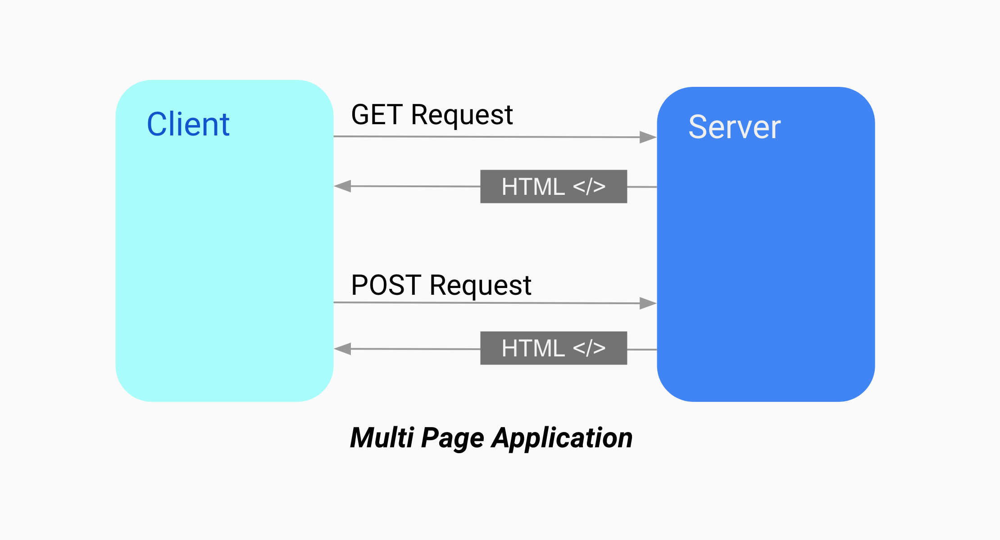
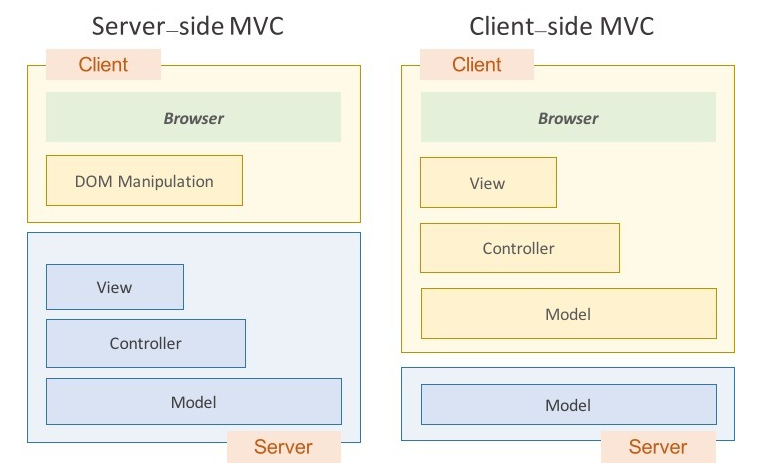

## 4.1 서버 사이드 렌더링(SSR)이란?


서버 사이드 렌더링(SSR)은 **서버에서 HTML을 미리 렌더링**한 후 **클라이언트에 전송**하는 방식이다. 과거에는 PHP나 JSP와 같은 기술을 통해 서버에서 완성된 HTML을 전달했으며, JavaScript는 보조적인 역할을 수행했다. 이후 JavaScript의 역할이 확장되면서 SPA(Single Page Application) 및 서버 사이드 렌더링과 같은 방식이 발전하게 되었다.

JAM Stack은 JavaScript, API, Markup으로 구성된 현대적인 웹 개발 아키텍처를 의미한다. JAM Stack은 정적 파일과 동적 데이터를 결합하여 빠르고 안전한 웹사이트를 만드는 것을 목표로 한다. 하지만 JavaScript의 기능이 확장되면서 클라이언트에서 처리해야 할 코드의 양도 증가하게 되었고, 이로 인해 CPU 소비와 페이지 로딩 속도가 문제가 될 수 있다. 이러한 문제를 해결하기 위해 서버 사이드 렌더링(SSR)과 같은 기술이 필요하게 되었다.

### 서버 사이드 렌더링의 장단점



#### 장점

- 초기 페이지 로딩 속도: 서버에서 HTML을 미리 렌더링하여 클라이언트에 전송하므로, SPA에서 클라이언트가 직접 HTTP 요청을 처리하는 것보다 초기 로딩 속도가 빠르다.

- 메타데이터 제공 가능: 검색 엔진 최적화(SEO)에 유리하며, HTML 메타데이터를 바로 제공할 수 있다.

- 누적 레이아웃 이동(Cumulative Layout Shift, CLS) 감소: SPA에서는 API 응답의 변동성으로 인해 레이아웃 이동이 발생할 수 있지만, SSR에서는 이러한 문제가 줄어든다.

- 디바이스 성능에 덜 의존적: 클라이언트 측에서의 부담을 서버가 분담하기 때문에, 사용자의 디바이스 성능에 영향을 덜 받는다.

- 보안성 향상: 클라이언트 측에서는 작업을 추적할 수 있지만, 서버에서 렌더링된 결과물만 클라이언트에 전달하므로 보안성이 높다.

#### 단점

서버 환경에 대한 고려 필요: SSR을 위해 클라이언트 전용 객체(window나 sessionStorage 등)를 사용할 수 없으므로 코드 작성 시 항상 서버 환경을 고려해야 한다.

적절한 서버 구축 필요: 서버에서 렌더링을 수행하기 위해 요청 분산과 서버 용량 확보 등의 관리가 필요하다.

서비스 지연 문제: 서버에서 렌더링하는 동안 지연이 발생할 수 있으며, SPA와 달리 로딩 화면으로 지연을 표현하기 어려울 수 있다.

## 4.2 서버 사이드 렌더링을 위한 React API

React는 서버 사이드 렌더링을 위해 react-dom/server 모듈에서 다양한 API를 제공한다.

### 4.2.1 renderToString

React 컴포넌트를 HTML 문자열로 변환한다.

이 과정에서는 useEffect와 같은 훅과 이벤트 핸들러가 포함되지 않는다.

반환된 HTML에는 data-reactroot 속성이 포함되어 있어, 클라이언트에서 이를 hydrate하는 진입점으로 사용한다.

### 4.2.2 renderToStaticMarkup

renderToString과 비슷하지만, React의 특정 속성(data-reactroot)을 제외한 단순한 HTML을 반환한다.

정적인 페이지를 생성할 때 사용된다. 예를 들어, 블로그나 상품 정보 페이지에 적합하다.

### 4.2.3 renderToNodeStream

renderToString과 유사하지만 HTML을 한 번에 모두 렌더링하지 않고 스트림을 통해 순차적으로 클라이언트에 전달한다.

이 API는 Node.js 환경에 의존하며, 반환 결과는 ReadableStream 타입이다. 이는 서버가 HTML을 점진적으로 생성하여 클라이언트로 전달하기 때문에 초기 로딩 속도가 개선된다.

대규모 HTML 페이지나 데이터가 많은 페이지에서 성능 최적화를 위해 사용된다. 클라이언트는 HTML을 점진적으로 받아 즉시 렌더링을 시작할 수 있다.

### 4.2.4 renderToStaticNodeStream

renderToNodeStream과 비슷하지만, 정적인 HTML을 스트리밍하며 클라이언트에서 hydrate가 불가능한 정적 페이지를 생성한다.

### 4.2.5 hydrate

이미 서버에서 생성된 정적인 HTML에 React의 이벤트 핸들러 등을 연결한다.

hydrate는 기존 HTML에 data-reactroot와 같은 속성이 포함된 경우에 사용되며, 클라이언트에서 추가적인 동적 기능을 부여하는 데 사용된다.

#### 예시 코드

```js
const entry = document.getElementById("root");
ReactDOM.render(<App />, entry); // 클라이언트에서 일반적인 렌더링

const entry2 = document.getElementById("root");
ReactDOM.hydrate(<App />, entry2); // 서버 사이드 렌더링 후 클라이언트에서 이벤트 연결
```
